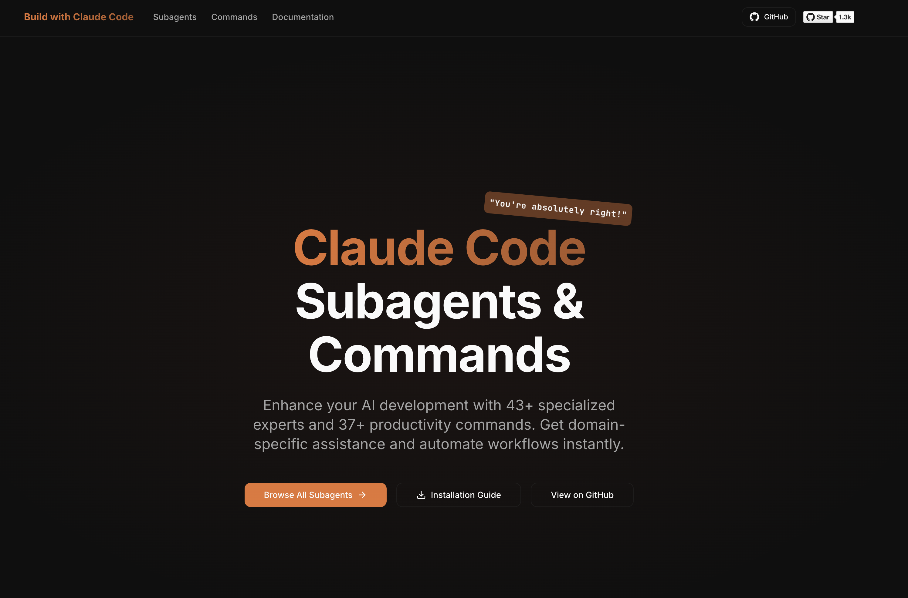
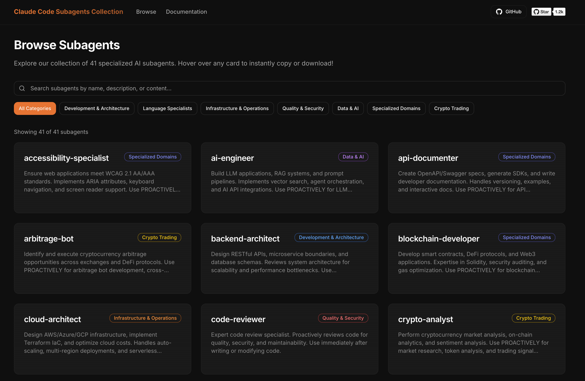

# Claude Code Subagents Collection

A comprehensive collection of specialized AI subagents for [Claude Code](https://docs.anthropic.com/en/docs/claude-code), designed to enhance development workflows with domain-specific expertise.

## 🌐 Now with a Web UI!

Browse, search, and install subagents instantly at [buildwithclaude.com](https://www.buildwithclaude.com)





## Overview

This repository contains 37 specialized subagents that extend Claude Code's capabilities. Each subagent is an expert in a specific domain, automatically invoked based on context or explicitly called when needed.

## Quick Start

```bash
# Clone the repository
git clone https://github.com/davepoon/claude-code-subagents-collection.git

# Copy all subagent files from the subagents directory
find claude-code-subagents-collection/subagents -name "*.md" -exec cp {} ~/.claude/agents/ \;

# Restart Claude Code to load the new subagents
```

## Available Subagents

### 🏗️ Development & Architecture
- **backend-architect** - Design RESTful APIs, microservice boundaries, and database schemas
- **frontend-developer** - Build Next.js applications with shadcn/ui, React Server Components, and Tailwind CSS
- **mobile-developer** - Develop React Native or Flutter apps with native integrations
- **graphql-architect** - Design GraphQL schemas, resolvers, and federation
- **directus-developer** - Build and customize Directus applications with extensions, hooks, and API integrations
- **drupal-developer** - Build and customize Drupal applications with custom modules, themes, and integrations

### 💻 Language Specialists
- **python-pro** - Write idiomatic Python code with advanced features and optimizations
- **golang-pro** - Write idiomatic Go code with goroutines, channels, and interfaces
- **rust-pro** - Write idiomatic Rust code with ownership, lifetimes, and type safety
- **typescript-expert** - Write type-safe TypeScript with advanced type system features

### 🚀 Infrastructure & Operations
- **devops-troubleshooter** - Debug production issues, analyze logs, and fix deployment failures
- **deployment-engineer** - Configure CI/CD pipelines, Docker containers, and cloud deployments
- **cloud-architect** - Design AWS/Azure/GCP infrastructure and optimize cloud costs
- **database-optimizer** - Optimize SQL queries, design efficient indexes, and handle database migrations

### 🛡️ Quality & Security
- **code-reviewer** - Expert code review for quality, security, and maintainability
- **security-auditor** - Review code for vulnerabilities and ensure OWASP compliance
- **test-automator** - Create comprehensive test suites with unit, integration, and e2e tests
- **performance-engineer** - Profile applications, optimize bottlenecks, and implement caching strategies
- **debugger** - Debugging specialist for errors, test failures, and unexpected behavior

### 📊 Data & AI
- **data-scientist** - Data analysis expert for SQL queries, BigQuery operations, and data insights
- **data-engineer** - Build ETL pipelines, data warehouses, and streaming architectures
- **ai-engineer** - Build LLM applications, RAG systems, and prompt pipelines
- **ml-engineer** - Implement ML pipelines, model serving, and feature engineering

### 🎯 Specialized Domains
- **api-documenter** - Create OpenAPI/Swagger specs and write developer documentation
- **payment-integration** - Integrate Stripe, PayPal, and payment processors
- **quant-analyst** - Build financial models, backtest trading strategies, and analyze market data
- **legacy-modernizer** - Refactor legacy codebases and implement gradual modernization
- **accessibility-specialist** - Ensure web applications meet WCAG 2.1 AA/AAA standards
- **blockchain-developer** - Develop smart contracts, DeFi protocols, and Web3 applications
- **game-developer** - Build games with Unity, Unreal Engine, or web technologies
- **ui-ux-designer** - Design user interfaces and experiences with modern design principles and accessibility standards
- **hyperledger-fabric-developer** - Develop Enterprise blockchain with Hyperledger Fabric

### 💰 Crypto Trading
- **crypto-trader** - Build cryptocurrency trading systems and integrate with exchange APIs
- **defi-strategist** - Design and implement DeFi yield strategies and liquidity provision
- **crypto-analyst** - Perform market analysis, on-chain analytics, and sentiment analysis
- **arbitrage-bot** - Identify and execute crypto arbitrage opportunities across markets
- **crypto-risk-manager** - Implement risk management systems for crypto portfolios

## Installation

### Prerequisites
- Claude Code installed and configured
- Access to the `~/.claude/agents/` directory

### Quick Installation via Web UI

Visit our [Web UI](https://www.buildwithclaude.com) to browse all subagents and easily:
- 📋 **Copy** any subagent's markdown content with one click
- 💾 **Download** individual subagent files directly
- 🔍 Search and filter by category
- 📖 Preview full documentation for each subagent

> **Note**: The Web UI automatically syncs with the main branch. Newly merged subagents appear within minutes of PR merge.

### Manual Installation Steps

1. **Clone this repository:**
   ```bash
   git clone https://github.com/davepoon/claude-code-subagents-collection.git
   cd claude-code-subagents-collection
   ```

2. **Option A: Install as User Subagents (available in all projects):**
   ```bash
   # macOS/Linux - Copy all subagent files from the subagents directory
   find subagents -name "*.md" -exec cp {} ~/.claude/agents/ \;
   
   # Alternative for macOS/Linux (if in the subagents directory)
   cp subagents/*.md ~/.claude/agents/
   
   # Windows - Copy all subagent files from the subagents directory
   for %f in (subagents\*.md) do copy "%f" %USERPROFILE%\.claude\agents\
   ```

   **Option B: Install as Project Subagents (only for current project):**
   ```bash
   # Navigate to your project directory first
   cd /path/to/your/project
   
   # Create the .claude/agents directory if it doesn't exist
   mkdir -p .claude/agents
   
   # macOS/Linux - Copy specific subagents you need
   find /path/to/claude-code-subagents-collection/subagents -name "*.md" -exec cp {} .claude/agents/ \;
   
   # Windows - Copy specific subagents you need
   mkdir .claude\agents 2>nul
   for %f in (\path\to\claude-code-subagents-collection\subagents\*.md) do copy "%f" .claude\agents\
   ```
   
   > **Note**: Project subagents are only available in the specific project where they're installed. Use this option when you want subagents tailored to a particular project or when testing new subagents.

3. **Verify installation:**
   ```bash
   # For user subagents
   ls ~/.claude/agents/
   
   # For project subagents
   ls .claude/agents/
   ```

4. **Restart Claude Code** to load the new subagents

## Usage

### Automatic Invocation
Claude Code automatically delegates to the appropriate subagent based on:
- Task context and requirements
- Keywords in your request
- File types being worked on
- Error messages or issues encountered

### Explicit Invocation
You can explicitly request a specific subagent in two ways:

#### Method 1: Natural Language
```
"Use the code-reviewer to check my recent changes"
"Have the security-auditor review this authentication code"
"Get the performance-engineer to optimize this function"
```

#### Method 2: @ Mentions
You can mention a subagent like tagging a person using the @ symbol, and it will jump in to help with your task:

```
"@agent-code-reviewer please check my recent changes"
"@agent-security-auditor can you review this authentication code?"
"@agent-performance-engineer help optimize this database query"
```

### Examples

#### Example 1: Automatic Code Review
```
User: "I just finished implementing the user authentication feature"
Claude: [Automatically invokes code-reviewer after detecting new code]
```

#### Example 2: Debugging Help
```
User: "I'm getting a TypeError in my React component"
Claude: [Automatically invokes debugger to analyze the error]
```

#### Example 3: Performance Optimization
```
User: "This query is running slowly"
Claude: [Automatically invokes database-optimizer to analyze and optimize]
```

#### Example 4: Crypto Trading
```
User: "Help me build a bot to trade on Binance"
Claude: [Automatically invokes crypto-trader to build trading system]
```

#### Example 5: DeFi Strategy
```
User: "I want to optimize my yield farming across protocols"
Claude: [Automatically invokes defi-strategist to design yield strategies]
```

## Subagent Format

Each subagent follows this structure:

```markdown
---
name: subagent-name
description: When this subagent should be invoked
category: category-name  # Required - see CONTRIBUTING.md for valid categories
tools: tool1, tool2  # Optional - defaults to all tools
---

System prompt defining the subagent's role and capabilities
```

### Key Components:
- **name**: Unique identifier for the subagent
- **description**: Triggers automatic invocation
- **category**: Organizational category (e.g., development-architecture, quality-security)
- **tools**: Specific tools the subagent can use (optional)
- **system prompt**: Detailed instructions and expertise

## Best Practices

### For Users
1. **Trust automatic delegation** - Claude Code knows when to use each specialist
2. **Be specific when needed** - Explicitly mention subagents for targeted help
3. **Combine specialists** - Complex tasks may benefit from multiple experts
4. **Provide context** - More information helps subagents work effectively

### For Development
1. **Let subagents focus** - Each should excel in one domain
2. **Write clear descriptions** - Help Claude Code know when to invoke
3. **Include examples** - Show how the subagent should respond
4. **Test thoroughly** - Ensure subagents work well together

## Troubleshooting

### Subagents not loading
1. Check the installation directory:
   ```bash
   ls ~/.claude/agents/
   ```
2. Ensure files have `.md` extension
3. Restart Claude Code
4. Check file permissions

### Subagent not being invoked
1. Use explicit invocation to test
2. Check the subagent's description
3. Verify the subagent file is valid Markdown
4. Look for syntax errors in the frontmatter

### Performance issues
1. Avoid overlapping subagent descriptions
2. Keep system prompts focused
3. Use specific tool restrictions when appropriate

## Contributing

We welcome contributions! To add a new subagent:

1. **Create a new file**: `subagent-name.md`
2. **Follow the format**:
   ```markdown
   ---
   name: your-subagent
   description: Clear description of when to use
   category: appropriate-category
   ---
   
   Detailed system prompt...
   ```

3. **Guidelines**:
   - Use lowercase, hyphen-separated names
   - Write clear, specific descriptions
   - Choose an appropriate category (see CONTRIBUTING.md for valid options)
   - Include concrete examples in the prompt
   - Test with various scenarios
   - Document any special requirements

4. **Submit a PR** with:
   - The new subagent file
   - Updated README listing
   - Example usage scenarios

5. **Automatic Deployment**: Once merged, your subagent will be automatically available on the [Web UI](https://www.buildwithclaude.com) within minutes.

## Advanced Configuration

### Custom Tool Restrictions
Some subagents specify which tools they can use:

```markdown
---
name: documentation-writer
tools: Read, Write, Edit
---
```

This improves performance and security by limiting capabilities.

### Subagent Chaining
Claude Code can use multiple subagents in sequence:
1. `code-reviewer` identifies issues
2. `debugger` investigates errors
3. `security-auditor` checks vulnerabilities

## Community

- **Issues**: Report bugs or request features
- **Discussions**: Share use cases and tips
- **Contributors**: See [CONTRIBUTORS.md](CONTRIBUTORS.md)

## Recent Updates

### Enhanced Subagents
- **frontend-developer** - Now specialized in Next.js 14+, shadcn/ui components, and modern React patterns including Server Components and App Router

### New Crypto Trading Subagents
- Added 5 specialized crypto trading subagents for trading systems, DeFi strategies, market analysis, arbitrage, and risk management

## Learn More

- [Claude Code Documentation](https://docs.anthropic.com/en/docs/claude-code)
- [Subagents Documentation](https://docs.anthropic.com/en/docs/claude-code/sub-agents)
- [Claude Code GitHub](https://github.com/anthropics/claude-code)

## License

This collection is provided under the MIT License. See [LICENSE](LICENSE) for details.

---

Made with ❤️ by the Claude Code community