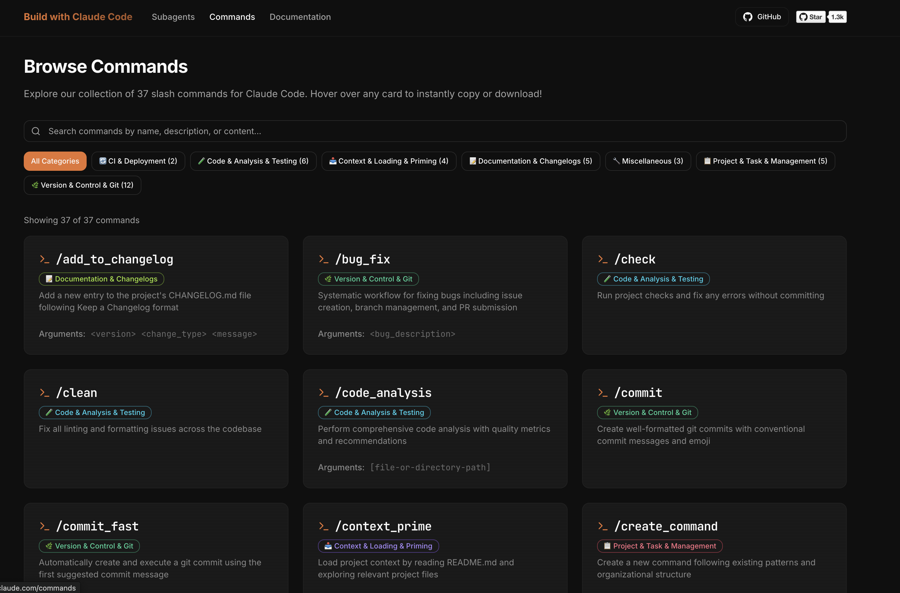

# Claude Code Subagents & Commands Collection

A comprehensive collection of specialized AI subagents and slash commands for [Claude Code](https://docs.anthropic.com/en/docs/claude-code), designed to enhance development workflows with domain-specific expertise and powerful automation.

## 🌐 Now with a Web UI!

Browse, search, and install both subagents and commands instantly at [buildwithclaude.com](https://www.buildwithclaude.com)




## Overview

This repository contains:
- **43+ Specialized Subagents**: AI experts in specific domains, automatically invoked based on context or explicitly called when needed
- **39+ Slash Commands**: Community-contributed commands for automating tasks, managing projects, and enhancing workflows

## Quick Start

### Install Everything (Recommended)
```bash
# Clone the repository
git clone https://github.com/davepoon/claude-code-subagents-collection.git
cd claude-code-subagents-collection

# Install all subagents
find subagents -name "*.md" -exec cp {} ~/.claude/agents/ \;

# Install all commands
find commands -name "*.md" -exec cp {} ~/.claude/commands/ \;

# Restart Claude Code to load everything
```

### Install Only Subagents
```bash
# Clone and install subagents
git clone https://github.com/davepoon/claude-code-subagents-collection.git
find claude-code-subagents-collection/subagents -name "*.md" -exec cp {} ~/.claude/agents/ \;
```

### Install Only Commands
```bash
# Clone and install commands
git clone https://github.com/davepoon/claude-code-subagents-collection.git
find claude-code-subagents-collection/commands -name "*.md" -exec cp {} ~/.claude/commands/ \;
```

## Available Subagents

### 🏗️ Development & Architecture
- **backend-architect** - Design RESTful APIs, microservice boundaries, and database schemas
- **frontend-developer** - Build Next.js applications with shadcn/ui, React Server Components, and Tailwind CSS
- **mobile-developer** - Develop React Native or Flutter apps with native integrations
- **graphql-architect** - Design GraphQL schemas, resolvers, and federation
- **directus-developer** - Build and customize Directus applications with extensions, hooks, and API integrations
- **drupal-developer** - Build and customize Drupal applications with custom modules, themes, and integrations

### 💻 Language Specialists
- **python-pro** - Write idiomatic Python code with advanced features and optimizations
- **golang-pro** - Write idiomatic Go code with goroutines, channels, and interfaces
- **rust-pro** - Write idiomatic Rust code with ownership, lifetimes, and type safety
- **typescript-expert** - Write type-safe TypeScript with advanced type system features

### 🚀 Infrastructure & Operations
- **devops-troubleshooter** - Debug production issues, analyze logs, and fix deployment failures
- **deployment-engineer** - Configure CI/CD pipelines, Docker containers, and cloud deployments
- **cloud-architect** - Design AWS/Azure/GCP infrastructure and optimize cloud costs
- **database-optimizer** - Optimize SQL queries, design efficient indexes, and handle database migrations

### 🛡️ Quality & Security
- **code-reviewer** - Expert code review for quality, security, and maintainability
- **security-auditor** - Review code for vulnerabilities and ensure OWASP compliance
- **test-automator** - Create comprehensive test suites with unit, integration, and e2e tests
- **performance-engineer** - Profile applications, optimize bottlenecks, and implement caching strategies
- **debugger** - Debugging specialist for errors, test failures, and unexpected behavior

### 📊 Data & AI
- **data-scientist** - Data analysis expert for SQL queries, BigQuery operations, and data insights
- **data-engineer** - Build ETL pipelines, data warehouses, and streaming architectures
- **ai-engineer** - Build LLM applications, RAG systems, and prompt pipelines
- **ml-engineer** - Implement ML pipelines, model serving, and feature engineering

### 🎯 Specialized Domains
- **api-documenter** - Create OpenAPI/Swagger specs and write developer documentation
- **payment-integration** - Integrate Stripe, PayPal, and payment processors
- **quant-analyst** - Build financial models, backtest trading strategies, and analyze market data
- **legacy-modernizer** - Refactor legacy codebases and implement gradual modernization
- **accessibility-specialist** - Ensure web applications meet WCAG 2.1 AA/AAA standards
- **blockchain-developer** - Develop smart contracts, DeFi protocols, and Web3 applications
- **game-developer** - Build games with Unity, Unreal Engine, or web technologies
- **ui-ux-designer** - Design user interfaces and experiences with modern design principles and accessibility standards
- **hyperledger-fabric-developer** - Develop Enterprise blockchain with Hyperledger Fabric

### 💰 Crypto Trading
- **crypto-trader** - Build cryptocurrency trading systems and integrate with exchange APIs
- **defi-strategist** - Design and implement DeFi yield strategies and liquidity provision
- **crypto-analyst** - Perform market analysis, on-chain analytics, and sentiment analysis
- **arbitrage-bot** - Identify and execute crypto arbitrage opportunities across markets
- **crypto-risk-manager** - Implement risk management systems for crypto portfolios

## Installation

### Prerequisites
- Claude Code installed and configured
- Access to the `~/.claude/agents/` and `~/.claude/commands/` directories

### Quick Installation via Web UI

Visit our [Web UI](https://www.buildwithclaude.com) to browse all subagents and commands:
- 📋 **Copy** any subagent or command's markdown content with one click
- 💾 **Download** individual files directly
- 🔍 Search and filter by category
- 📖 Preview full documentation
- 🤖 Browse specialized AI subagents
- 🔪 Explore slash commands for automation

> **Note**: The Web UI automatically syncs with the main branch. Newly merged subagents and commands appear within minutes of PR merge.

### Manual Installation Steps

1. **Clone this repository:**
   ```bash
   git clone https://github.com/davepoon/claude-code-subagents-collection.git
   cd claude-code-subagents-collection
   ```

2. **Install Subagents:**

   **Option A: Install as User Subagents (available in all projects):**
   ```bash
   # macOS/Linux - Copy all subagent files from the subagents directory
   find subagents -name "*.md" -exec cp {} ~/.claude/agents/ \;
   
   # Alternative for macOS/Linux (if in the repository directory)
   cp subagents/*.md ~/.claude/agents/
   
   # Windows - Copy all subagent files from the subagents directory
   for %f in (subagents\*.md) do copy "%f" %USERPROFILE%\.claude\agents\
   ```

   **Option B: Install as Project Subagents (only for current project):**
   ```bash
   # Navigate to your project directory first
   cd /path/to/your/project
   
   # Create the .claude/agents directory if it doesn't exist
   mkdir -p .claude/agents
   
   # macOS/Linux - Copy specific subagents you need
   find /path/to/claude-code-subagents-collection/subagents -name "*.md" -exec cp {} .claude/agents/ \;
   
   # Windows - Copy specific subagents you need
   mkdir .claude\agents 2>nul
   for %f in (\path\to\claude-code-subagents-collection\subagents\*.md) do copy "%f" .claude\agents\
   ```
   
   > **Note**: Project subagents are only available in the specific project where they're installed. Use this option when you want subagents tailored to a particular project or when testing new subagents.

3. **Install Commands:**

   **Option A: Install as User Commands (available in all projects):**
   ```bash
   # macOS/Linux - Copy all command files from the commands directory
   find commands -name "*.md" -exec cp {} ~/.claude/commands/ \;
   
   # Alternative for macOS/Linux (if in the repository directory)
   cp commands/*.md ~/.claude/commands/
   
   # Windows - Copy all command files from the commands directory
   for %f in (commands\*.md) do copy "%f" %USERPROFILE%\.claude\commands\
   ```

   **Option B: Install as Project Commands (only for current project):**
   ```bash
   # Navigate to your project directory first
   cd /path/to/your/project
   
   # Create the .claude/commands directory if it doesn't exist
   mkdir -p .claude/commands
   
   # macOS/Linux - Copy specific commands you need
   find /path/to/claude-code-subagents-collection/commands -name "*.md" -exec cp {} .claude/commands/ \;
   
   # Windows - Copy specific commands you need
   mkdir .claude\commands 2>nul
   for %f in (\path\to\claude-code-subagents-collection\commands\*.md) do copy "%f" .claude\commands\
   ```
   
   > **Note**: Project commands are only available in the specific project where they're installed. Use this option for project-specific commands or when testing new commands.

4. **Verify installation:**
   ```bash
   # For user subagents
   ls ~/.claude/agents/
   
   # For project subagents
   ls .claude/agents/
   
   # For user commands
   ls ~/.claude/commands/
   
   # For project commands
   ls .claude/commands/
   ```

5. **Restart Claude Code** to load the new subagents and commands

## Usage

### Using Subagents

#### Automatic Invocation
Claude Code automatically delegates to the appropriate subagent based on:
- Task context and requirements
- Keywords in your request
- File types being worked on
- Error messages or issues encountered

#### Explicit Invocation
You can explicitly request a specific subagent in two ways:

**Method 1: Natural Language**
```
"Use the code-reviewer to check my recent changes"
"Have the security-auditor review this authentication code"
"Get the performance-engineer to optimize this function"
```

**Method 2: @ Mentions**
```
"@agent-code-reviewer please check my recent changes"
"@agent-security-auditor can you review this authentication code?"
"@agent-performance-engineer help optimize this database query"
```

### Using Commands

Commands are invoked using the `/` prefix followed by the command name:

```
/commit                     # Create a commit with staged changes
/create_pr                  # Create a pull request
/todo add "Fix bug"         # Add a todo item
/docs                       # Generate documentation
/code_analysis              # Analyze code quality
```

Commands can accept arguments:
```
/commit --no-verify         # Skip pre-commit hooks
/todo list                  # List all todos
/create_prd "User Auth"     # Create PRD for user authentication
```

### Examples

#### Subagent Examples

**Example 1: Automatic Code Review**
```
User: "I just finished implementing the user authentication feature"
Claude: [Automatically invokes code-reviewer after detecting new code]
```

**Example 2: Debugging Help**
```
User: "I'm getting a TypeError in my React component"
Claude: [Automatically invokes debugger to analyze the error]
```

#### Command Examples

**Example 1: Creating a Commit**
```
User: /commit
Claude: [Analyzes changes, creates conventional commit message]
```

**Example 2: Managing Todos**
```
User: /todo add "Implement user authentication"
Claude: [Adds todo item to project tracking]
```

**Example 3: Creating Documentation**
```
User: /docs
Claude: [Generates documentation based on project structure]
```

## Available Commands

### 🔧 Version Control & Git
- `/commit` - Create well-formatted commits with conventional messages
- `/create-pr` - Create pull requests with proper formatting
- `/fix-pr` - Fix issues in existing pull requests
- `/update-branch-name` - Update branch names following conventions

### 🧪 Code Analysis & Testing
- `/code_analysis` - Analyze code quality and suggest improvements
- `/optimize` - Optimize code performance
- `/tdd` - Start test-driven development workflow

### 📥 Context Loading & Priming
- `/prime` - Load project context into Claude
- `/context-prime` - Prime Claude with specific context
- `/initref` - Initialize reference documentation

### 📝 Documentation & Changelogs
- `/docs` - Generate or update documentation
- `/create-docs` - Create new documentation files
- `/add-to-changelog` - Add entries to changelog

### 📋 Project & Task Management
- `/todo` - Manage project todos
- `/create-prd` - Create product requirement documents
- `/create-jtbd` - Create Jobs-to-be-Done documentation

[View all 39+ commands on the Web UI](https://www.buildwithclaude.com/commands)

## Subagent Format

Each subagent follows this structure:

```markdown
---
name: subagent-name
description: When this subagent should be invoked
category: category-name  # Required - see CONTRIBUTING.md for valid categories
tools: tool1, tool2  # Optional - defaults to all tools
---

System prompt defining the subagent's role and capabilities
```

### Subagent Components:
- **name**: Unique identifier for the subagent
- **description**: Triggers automatic invocation
- **category**: Organizational category (e.g., development-architecture, quality-security)
- **tools**: Specific tools the subagent can use (optional)
- **system prompt**: Detailed instructions and expertise

## Command Format

Each command follows this structure:

```markdown
---
description: Brief explanation of what the command does
category: category-name  # Required - see commands/README.md for categories
argument-hint: <optional-args>  # Optional
allowed-tools: tool1, tool2  # Optional
model: opus|sonnet|haiku  # Optional
---

Command instructions and implementation details
```

### Command Components:
- **description**: Brief explanation (10-200 characters)
- **category**: Organizational category for the command
- **argument-hint**: Expected arguments (optional)
- **allowed-tools**: Restrict which tools can be used (optional)
- **model**: Specify model preference (optional)

## Best Practices

### For Using Subagents
1. **Trust automatic delegation** - Claude Code knows when to use each specialist
2. **Be specific when needed** - Explicitly mention subagents for targeted help
3. **Combine specialists** - Complex tasks may benefit from multiple experts
4. **Provide context** - More information helps subagents work effectively

### For Using Commands
1. **Learn common commands** - Familiarize yourself with frequently used commands
2. **Check arguments** - Use `/command_name --help` if unsure about arguments
3. **Chain commands** - Some commands work well together (e.g., `/code_analysis` then `/optimize`)
4. **Project vs User scope** - Install project-specific commands locally, general ones globally

### For Development
1. **Single responsibility** - Each subagent/command should excel in one domain
2. **Clear descriptions** - Help users understand when to use each tool
3. **Generic implementations** - Commands should work across different project types
4. **Test thoroughly** - Ensure compatibility with various environments

## Troubleshooting

### Subagents not loading
1. Check the installation directory:
   ```bash
   ls ~/.claude/agents/          # User subagents
   ls .claude/agents/            # Project subagents
   ```
2. Ensure files have `.md` extension
3. Restart Claude Code
4. Check file permissions

### Commands not working
1. Verify installation:
   ```bash
   ls ~/.claude/commands/        # User commands
   ls .claude/commands/          # Project commands
   ```
2. Check command syntax - use underscores: `/create_pr` not `/create-pr`
3. Ensure frontmatter is valid
4. Restart Claude Code after installation

### Subagent not being invoked
1. Use explicit invocation to test
2. Check the subagent's description
3. Verify the subagent file is valid Markdown
4. Look for syntax errors in the frontmatter

### Command errors
1. Check if arguments are required
2. Verify allowed-tools restrictions
3. Ensure command has proper implementation
4. Test with simpler arguments first

### Performance issues
1. Avoid overlapping subagent descriptions
2. Keep system prompts focused
3. Use specific tool restrictions when appropriate
4. Install only needed commands/subagents for projects

## Contributing

We welcome contributions for both subagents and commands!

### Contributing Subagents

To add a new subagent:

1. **Create a new file** in `subagents/`: `subagent-name.md`
2. **Follow the format**:
   ```markdown
   ---
   name: your-subagent
   description: Clear description of when to use
   category: appropriate-category
   ---
   
   You are a [role description]...
   ```

3. **Submit a PR** with:
   - The new subagent file in `subagents/` directory
   - Updated README listing
   - Example usage scenarios

### Contributing Commands

To add a new command:

1. **Create a new file** in `commands/`: `command-name.md`
2. **Follow the format**:
   ```markdown
   ---
   description: Brief explanation of the command
   category: appropriate-category
   argument-hint: <optional-args>  # if applicable
   ---
   
   Command implementation details...
   ```

3. **Submit a PR** with:
   - The new command file in `commands/` directory
   - Clear documentation and examples

### Guidelines for Both:
- Use lowercase, hyphen-separated names
- Write clear, specific descriptions
- Choose appropriate categories (see CONTRIBUTING.md)
- Test thoroughly before submitting
- Include usage examples

**Automatic Deployment**: Once merged, your contributions will be automatically available on the [Web UI](https://www.buildwithclaude.com) within minutes.

## Advanced Configuration

### Custom Tool Restrictions
Some subagents specify which tools they can use:

```markdown
---
name: documentation-writer
tools: Read, Write, Edit
---
```

This improves performance and security by limiting capabilities.

### Subagent Chaining
Claude Code can use multiple subagents in sequence:
1. `code-reviewer` identifies issues
2. `debugger` investigates errors
3. `security-auditor` checks vulnerabilities

## Community

- **Issues**: Report bugs or request features
- **Discussions**: Share use cases and tips
- **Contributors**: See [CONTRIBUTORS.md](CONTRIBUTORS.md)

## Recent Updates

### Enhanced Subagents
- **frontend-developer** - Now specialized in Next.js 14+, shadcn/ui components, and modern React patterns including Server Components and App Router

### New Crypto Trading Subagents
- Added 5 specialized crypto trading subagents for trading systems, DeFi strategies, market analysis, arbitrage, and risk management

## Learn More

- [Claude Code Documentation](https://docs.anthropic.com/en/docs/claude-code)
- [Subagents Documentation](https://docs.anthropic.com/en/docs/claude-code/sub-agents)
- [Claude Code GitHub](https://github.com/anthropics/claude-code)

## License

This collection is provided under the MIT License. See [LICENSE](LICENSE) for details.

---

Made with ❤️ by the Claude Code community